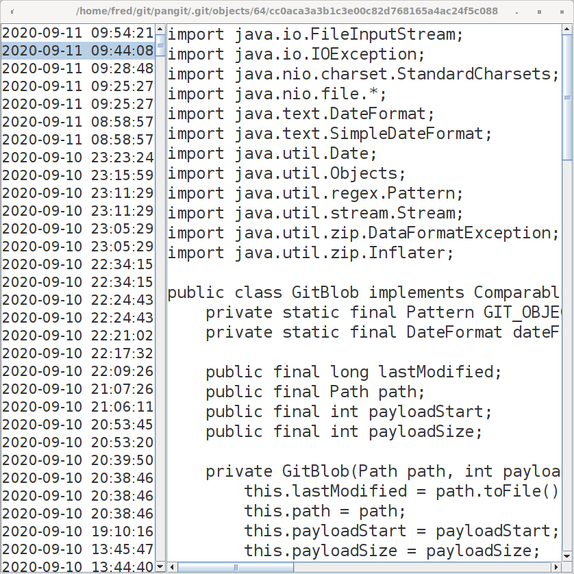

## Background

Have you ever staged some files in git, forgot to commit them and then messed something up?
Fear not, staged files are usually recoverable within a certain time frame!

pangit lets you browse all recently staged files, even uncommitted ones, sorted by most recently staged.
(Doing this manually with git plumbing commands is possible, but tedious.)

## How do I compile pangit into an executable jar?
```
git clone https://github.com/fredoverflow/pangit
cd pangit
mvn package
```
The executable `pangit.jar` will be located inside the `target` folder.
